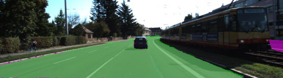

# Semantic Segmentation

### Introduction
This is the second project of the last term of the self driving car nanodegree. The goal of this project is to train a [Fully Convolutional Network](https://arxiv.org/abs/1411.4038) (FCN) that is able to detect the pixels of a road in images. 
An FCN is a CNN without any fully-connected layers. In this project we used pretrained VGG16 model, replaced the fcn layers with 1x1 convolutional layers and added several deconvolution as well as skip connection layers. The result is fully convolutional network which is able to classify pixels in provided images.

### Program Usage

##### Frameworks and Packages
Make sure you have the following is installed:
 - [Python 3](https://www.python.org/)
 - [TensorFlow](https://www.tensorflow.org/)
 - [NumPy](http://www.numpy.org/)
 - [SciPy](https://www.scipy.org/)
 - 
##### Dataset
Download the [Kitti Road dataset](http://www.cvlibs.net/datasets/kitti/eval_road.php) from [here](http://www.cvlibs.net/download.php?file=data_road.zip).  Extract the dataset in the `data` folder.  This will create the folder `data_road` with all the training a test images.

##### Start
Run the following command to run the project:
```
python main.py
```

I've added some more options:
```sh
usage: main.py [-h] [-t] [-e] [-m [MODEL]]

Semantic Segmentation of road pixels in images.Calling main.py without any
cmdline args will train a model with all images available in the training set.
If you call main.py -e then the model will be trained with 90% of the training
images and the remaining 10% will be used for model evaluation

optional arguments:
  -h, --help            show this help message and exit
  -t, --train_evaluate  Trains and evaluates a model
  -e, --evaluate        Evaluates a model.
  -m [MODEL], --model [MODEL]
                        Path to the model that shall be restored and used.
```

### Network Parameters
- Epochs = 20
- Batch_Size = 2
- Learning_Rate = 0.0001
- Dropout = 0.7
- num_classes = 2 (Background or Road)
- image_shape = (160, 576)

### Result
I carried out two experiments. 
#### Experiment 1
In the first experiment I trained the network with all training images. The figure below shows the loss curve with a final loss value of 0.02163.

<a href="url"></a>

And here you can see some inference results

  
  


#### Experiment 2
In the second experiment is splitted the training set into training and a test set. Then I trained the model and evaluated the model with the IoU (Intersection over Union) metric.


Then I took the test images and overlayed the corresponding ground truth (cyan) and the prediction result (green). Some results are shown below:
  
  


